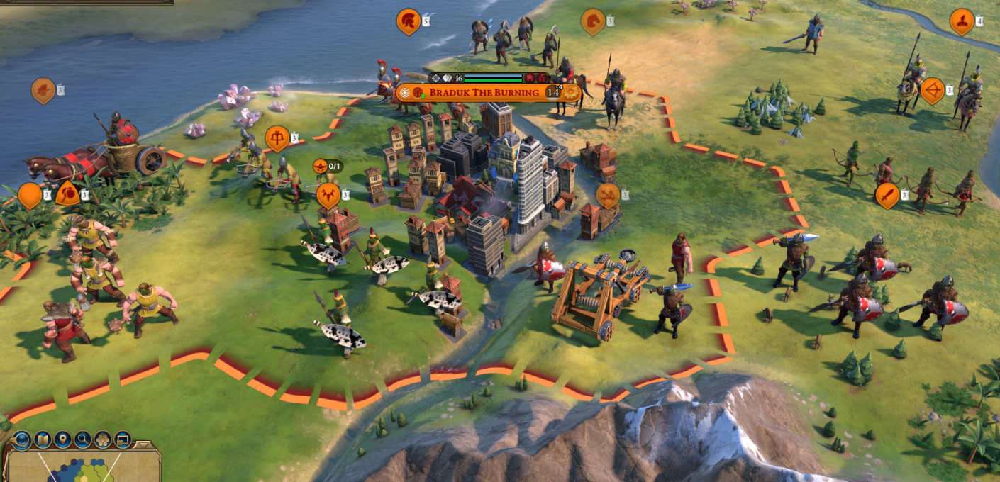
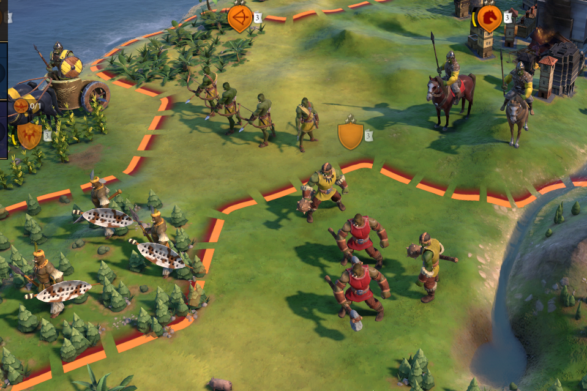
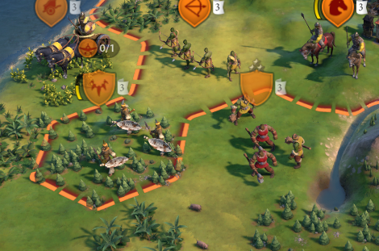
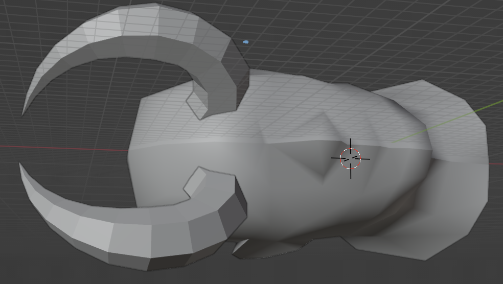
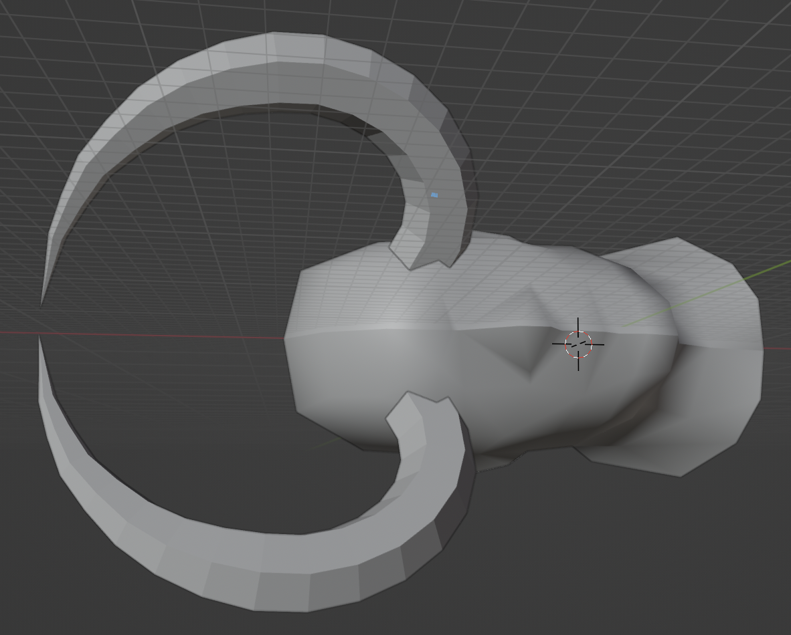
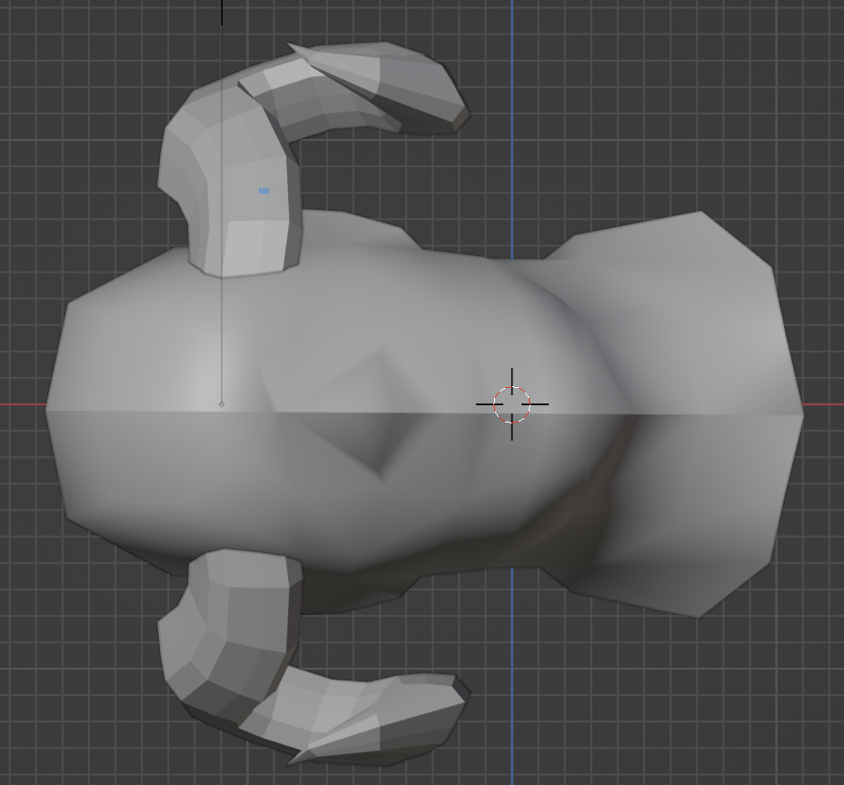
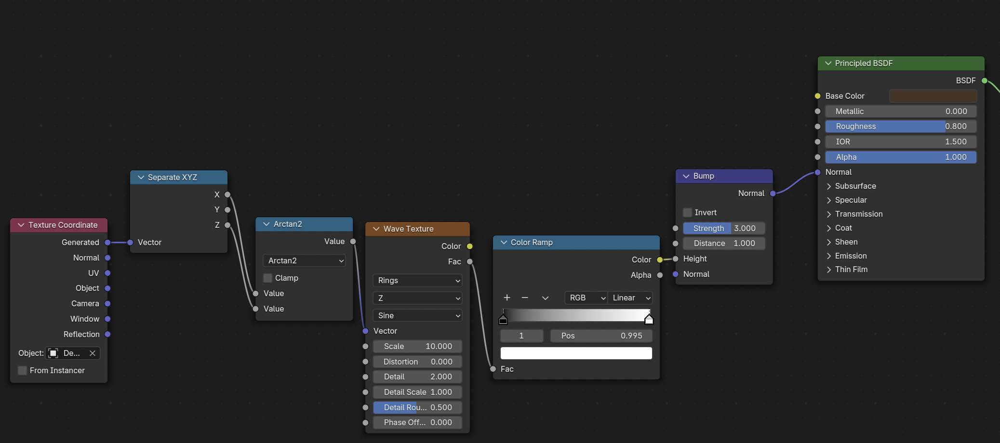
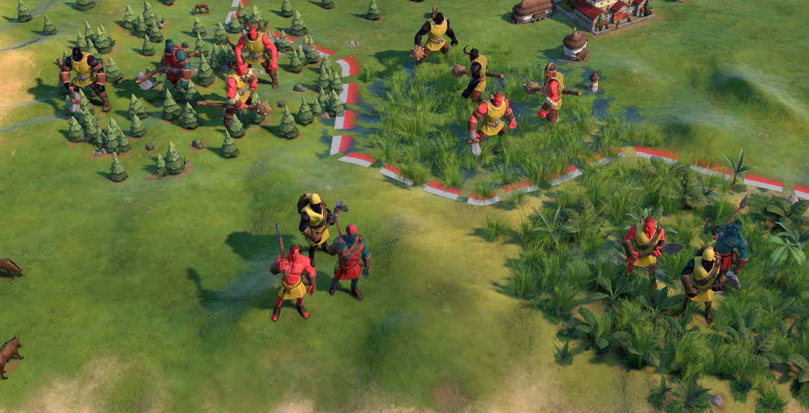

For doing custom cultures like Orcs and Demons, retinting the unit skins much like how skins are tinted for different ethnicities was a natural fit.

The main hurdle was writing a script that gathered all the existing units cultural variants, so I could add to them, and see what the format was. Parsing XML is a big headache since Extensible Markup Language does what it says on the tin, Firaxis have extended it so a basic parser can fail in places, so I had to do some custom work to get out what I needed from the existing artdefs. But in essence, I glob'd the file structure of the base game and the DLC files for UnitBins.artdef files and then processed each file found. I then iterated through each entry that had cultural elements, and an associated TintType, and appended a copy of the first entry twice, one for Orcs, one for Demons. Then modified those entries to the tint's I liked. This allowed the two civs with those cultures, the Clan of Embers and the Infernal to have custom Tints by adding a corresponding entry in Cultures.artdef, as well as the barbarian race, which will use the Orc tinting. The downside to this is making a custom culture entry then removes the work I had done assigning Civilization building Culture in Cultures.artdef. However, for both of those races, there wasnt a clear option, it would be mud wattle houses in the Ancient era, and preferably camps/warrens for both races in the Classical/Medieval/Renaissance era, since they are Evil (with a capital E).

Orcs were reasonably simple, two shades of green that looked both realistic and popped decently against the terrain, and a brown to add some variance and emphasise a loose band of clans. Initially I had difficulty getting a brown that fit in Civ, that wasn't an existing real world race. But i found a clayish brown that suited. Here are some earlier efforts that didnt quite pan out, too dark for civs palette:

I then had to do some work in removing more human-like clutter, like the hairstyles. I am still unsure of giving Orcs hair, I feel the trend towards it is very World of Warcraft, and was probably done to humanise the characters (sure Thrall has hair, but the lowly Peon certainly does not). I think I'm going for a more Tolkienesque Orc, well maybe not quite as black and white as Tolkien, but certainly Evil. So no hair, and to add more flavour rather than people thinking its just a college bodypainting party where they only had one paint colour, some unit culture stuff to make them well, Orcish. My first thought was a pair of tusks, which I thought would clearly portray them as Orcs, and give a brutish strength they should have. This was my first proper encounter with blender, and after some great difficulty, I extruded a pipe and kinked it at 45 degrees twice to give a very low poly horn. Then after some help from the lovely people at the Modding Helpline, I managed to get it in game using the CivNexus blender scripts and then CivNexus itself, using the rather exhaustive UnitTutorial provided by LINK. I was far too new to know how to colour it, so I figured i would just use a white material, which ended up being a Sail texture amusingly. Immediately it was clear it had some design problems:

Its teeeny. It also isnt that clear against the Orcs themselves. I had planned to make even smaller versions with broken tusks, but clearly i needed to scale up. Also its not that noticeable, but the tusk never makes contact with the head, it just sort of floats there.

It also was a bad allocation of polygon budget. It was something like 150 triangles, for a very small effect, which could have performance issues. So i resolved to change some things for V2.

V2 of the tusk was similarly fraught, I attempted to make it both taller and more realistically pointed, but this lead to similar issues with the poly count budget, even if it looked prettier. I then attempted to learn how to bake a Normal Map of the hi-poly version, and transfer it to the low-poly mesh, so it would look nice in-game with the normal map texture applied. However this was similarly fraught, I believe mostly because the cylinder geometry really doesn't suit this poly baking. I also did some work with the Decimate modifier to reduce the geometry while keeping the original shape, but the effect was somewhat, Ocarina of Time-ish, with very jagged edges in places. Looking back it probably would have been an idea to try retopologising with something like Quadriflow Remesh, or a voxel approach. Irregardless, with the removal of hair, this is beginning to look properly orcish, not my best work, but passable:

An unintended side effect was that a lack of hair was leading to a buzzcut type look, which did oddly suit the gruff orcs. I still want to get a completely bald orc as well though, and I've seen some caucasian models with that, so male pattern baldness is not out of reach. 

As I was feeling quite disheartened by the Orc tusk work, I thought I'd move onto something similar but different, Devil horns. I had found an excellent [tutorial](https://www.youtube.com/watch?v=5BXvwqVyCQw&) on methods of producing nice horns that go to a point for the tusk work, and wanted to try it out. There was a lot of pitfalls, mostly involved in that art being used for 3d printing, and so did not care about poly count. I had a lovely looking horn that was 8000 triangles all on its own, but obviously that isnt tenable when so many could be on the screen. I did make a new low poly version and try baking a normal map down, but it was something like losing 99.75 vertices, so it was impossible for it to keep its shape.

For devil horns, I had quite a few inspirations. I wanted the traditional devils horns on the forehead, pointed like a bulls, Rams horns that were on the side of the head, some halloween-esque horns that would be on the side of the head and curve up to a point. I definitely learnt from the tusk debacle that I couldn't have some muted little effects, I was hoping to also do some Fawn and Satyr horns where the Fawn unit upgrades to the Satyr. And the fawn would have little Mr Tumnus horn nubs, that would grow to decent antlers. But those details would be lost. So instead the Fawn would have decent antlers and the Satyr very impressive ones. And those nubbins were also planned for an imp unit, but instead I've given them the forehead pointy ones. Since bigger is better, the Rams horns are also quite large, and the front pointed horns upgraded to the sort Illidan has in his demon form (Warcraft can still be good for some things). Most of the time and frustration was spent on dealing with issues I had in generating the horns, nominally using Bezier curves to draw the horn direction, and a Mesh with an Array modifier and a Curve modifier to align the components along the horn direction. So much time was lost slashing my poly count, simplifying the mesh in places where it wouldnt be seen.

I also learnt from the Orc debacle and imported a male head from the game for context and scale and to make sure the horns broke the skin! I haven't got round to it, but I'm also planning on setting up some rendering camera angles to replicate the default game height, but there is some debate on what it would be, and also some pain in fiddling with the camera aperture and other settings to replicate VI.

Unfortunately, the rams horn has fallen through, theres some bug where the top half of the mesh is invisible, and you can see through it ingame. Once i figure out that it will be back to the races.

When doing these horns, my plan was to colour them white, but then i thought, white horns/tusks are more bleached with age/after death. And looking at actual Ram horns showed they tended to be brownish/tan/black. I also thought for some variety and because there was no rendering cost it would be nice to do some features seen in horns like growth rings. ChatGPT (or rather, Claude) came through here, it took me about 5 minutes to set up a nice procedurally generated method to apply a set of rings travelling up each horn, and it definitely made them more grounded and "real". Then about twenty minutes dealing with the finicky stuff, like it not applying across the right axis sometimes. But this was good, it was a great crash course in the Node system used for shading.

I haven't gone too much into the exporting process for meshs, mostly because I follow it religiuosly and superstitiously, not really understanding it. But the process of exporting textures for a material helped me understand how textures work in games. Baking was a bit contrived, but made sense, although I just used the default UV unwrapping, as I still dont understand seams. But its amazing the level of control the game gives you once you are willing to commit to blender.

Following all the import process and making the materials from the imported textures in Asset Editor, here was the result in game (helmets and do-rags subject to removal):

You can see I also did some UnitTints here, but they are very WIP. The blue feels more undead/ Octopus Overlords, and the black is unfortunately close to Blackface as the eyes are not the same colour. The red too is a bit too saturated, when I was testing different colours without any horns, a darker realistic red colour felt quite Native American, which is definitely not what i want, but I think the horns and eventually wings will clear that up. If I could do an overhaul of the material, using greys and blacks amongst a darker red, that would be ideal, but given all the different body types, that opens another whole kettle of fish and about 50 materials I would think. I plan to do some more testing with the console and 'reload artdef unit_bins', which has vastly sped up my time choosing colours.

P.S. the jersey is also WIP, that was just a test one I applied to all civs as I haven't yet decided on the colour schemes. Although I plan to use that yellow and red (lifted verbatim from Merrick's excellent Sicily as it was my reference for unitTints by civ) for the Balseraphs, as it fits their motley aesthetic.

Next steps are demon wings, which will be very difficult because of both animations, which I haven't touched, and clipping issues. Taking those next steps might be done with some cloven goat legs though, which I will need anyways for the Fawn/Satyr/Hyborem, that will also need animations but will probably be able to reuse existing leg animations and bones.

I'm also planning a hi-poly horn and wings for Hyborem, given hes a unique hero and the figurehead of the Infernal, he deserves some extra loving. That will probably be done later on though when I'm in a per unit basis. I am thinking another cool option would be some of the Qunari horns from Dragon Age.

The horns are in place of hair, so I can also do some variance by using the beard slot for more demonic features. Some could have tusks even, or other bony protrusions, maybe some nose jobs to make the underlying units look less human.

But I think I would only do that level of polish once I have other cultures and units in a good place already.

There are also some orc plans, as I said I dont like hair, but just baldness is boring. I'm thinking of doing some bone spikes, maybe like the exposed bones from the Titans from Arkham Asylum:

